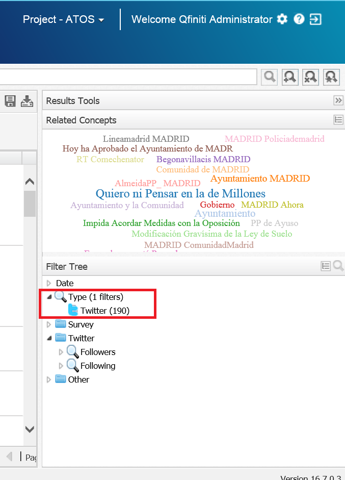
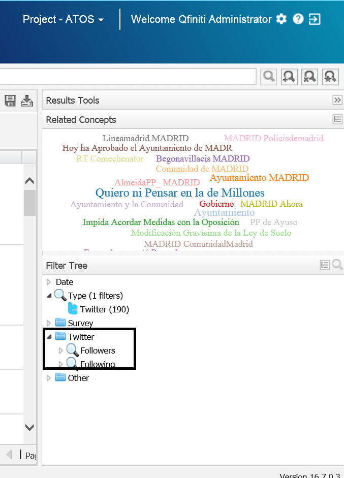
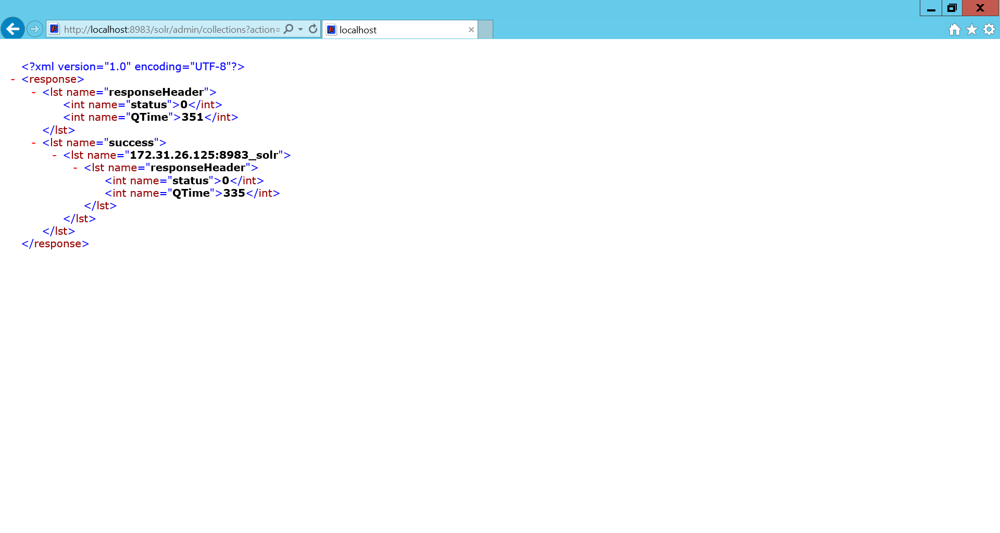

# OpenText Explore Twitter Importer

This command-line application listens to a Twitter Stream applying the filters, defined in twitter4j.properties, to select the tweets of our interest.

These tweets are inserted into the Solr Server used by **OpenText Explore**. 

Once the tweets are available in **OpenText Explore** you can create your owns dashboards to analyze the information listened.


> [OpenText™ Explore](https://www.opentext.com/products-and-solutions/products/customer-experience-management/contact-center-workforce-optimization/opentext-explore) is a business discovery solution that allows business and call center professionals to view cross-channel interactions collectively for a comprehensive picture of customer behaviors and relationships. 

## Twitter stream API

There are a number of properties available for configuring Twitter4J (required to listen the Twitter stream). You can specify properties via **twitter4j.properties** file as follows : 

### via twitter4j.properties
Standard properties file named **"twitter4j.properties"**. Place it to either the current directory, root of the CLASSPATH directory.

```
oauth.consumerKey=*********************
oauth.consumerSecret=******************************************
oauth.accessToken=**************************************************
oauth.accessTokenSecret=******************************************
```

> SEE: [Twitter4J: Generic properties](http://twitter4j.org/en/configuration.html)

> NOTE: You need a [Twitter Developer](https://developer.twitter.com/en) account to get access to the Twitter Stream.

## Configuration file: twitter-importer.properties

Configuration file that specifies the filter to apply to the Twitter stream

It supports theses properties:

 - languages - Specifies the tweets language of the stream (You can specify more than one separated by commas)
 - keywords - Specifies keywords to track (You can specify more than one separated by commas). 
 - follow - Twitter account names separated by commas (Don't include the @), e.g. madrid to follow @madrid
 - tag - Text to be used as tag to be added automatically to each twitt. Default value: "Twitter Importer"
 - verbose - Verbose mode. Possible values: true (messages are shown in the console) or false (messages are NOT shown in the console)
 - host - Solr server URL. Default value: http://localhost:8983

This **twitter-importer.properties** file shows an example to listen to tweets about Madrid City Hall in Spanish: 
 
```
languages=es
keywords=Ayuntamiento de Madrid,Ayto Madrid,@MADRID
verbose=true
host=http://localhost:8983
follow=madrid,lineaMadrid
tag=Twitter Importer
```

## Command line execution 

This utility is distributed as a runnable .jar file.

These are the accepted parameters:

usage: java -jar OTExploreTwitterImporter-20.2.jar
 * -c, --config						Define config file path

### Example of invocation

```
$ java -jar OTExploreTwitterImporter-20.2.jar --config "C:\ProgramFiles\OTExploreTwitterImporter\twitter-importer.properties"
```

# Explore configuration

## Explore.Configuration.xml

The configuration file **Explore.Configuration.xml** is located at **<EXPLORE_HOME>\Explore.Configuration.xml**, e.g. 

```
D:\Program Files (x86)\OpenText\Explore\Explore.Configuration.xml 
```

### Twitter DocType

We must add a new DocType tag under the **<DocTypes>** in Explore.Configuration.xml in order to identify Twitter as a new input/document type analyzed by Explore:

```xml
  <DocTypes>
    ...  
    <DocType>
      <Name>Twitter</Name>
      <GridFields>
        <Field column="Source">
          <Name>Followers</Name>
          <Tag>followers</Tag>
        </Field>
        <Field column="Source">
          <Name>Following</Name>
          <Tag>following</Tag>
        </Field>
      </GridFields>
    </DocType>	
  </DocTypes>
```




### Group Twitter


We must add a new **Group** tag under the **<DoCriteriaItemscTypes>** in Explore.Configuration.xml in order to identify Twitter as a new group that can be used to filter by:

```xml
  <!--<CriteriaItem parametric="true" advancedSearch="true" trendWidget="true" autoPopulate="true" reloadUserData="true" groupBy="single" numberBuckets="6">
    parametric:     Show criteria item in the filter section on the search tab. Default value: false
    advancedSearch: Show criteria in the advanced search dialog. . Default value: true
    trendWidget:    Display criteria in the trend widget settings dialog. Only to be used with numeric criterias. Default value: false
    reloadUserData: Allows to reload user values for a parametric criteria. EG MAS Source. Default value: false
    groupBy:        Allows to group values in 3 ways: "single", "numeric" or "alphabetical"
    numberBuckets:  Number of buckets when gruping using numeric or alphabetical. Default value: 5
    numericStats:   Numeric criteria to be used in the Statistical Summary or in the High and Low Comparison widget.    
    -->

  <CriteriaItems>
  
    ...
      
    <Group name="Twitter">	             
      <CriteriaItem parametric="true" groupBy ="numeric" numberBuckets="10" advancedSearch="true" numericStats="true">
        <Name>Following</Name>
        <Tag>following</Tag>
        <ComparatorGroup>numeric</ComparatorGroup>
        <AssociatedDocTypes>
          <DocType>Twitter</DocType>
        </AssociatedDocTypes>
      </CriteriaItem>

      <CriteriaItem parametric="true" groupBy ="numeric" numberBuckets="10" advancedSearch="true" numericStats="true">
        <Name>Followers</Name>
        <Tag>followers</Tag>
        <ComparatorGroup>numeric</ComparatorGroup>
        <AssociatedDocTypes>
          <DocType>Twitter</DocType>
        </AssociatedDocTypes>		
      </CriteriaItem>
    </Group>  
  </CriteriaItems>    
```


## schema.xml (Solr)

The Solr configuration file **schema.xml** is located at **<SOLR_HOME>\solr-7.3.1\server\solr\configsets\interaction_config** e.g. 

```
D:\SolrCloud\solr-7.3.1\server\solr\configsets\interaction_config
```

### New Twitter fields on Solr

We must define new fields to be able to import extra metadata related with each Twitt 

```xml

  <!-- ADD YOUR CUSTOM FIELDS HERE -->

  <field name="followers" type="pint" indexed="true" 	stored="false" 	docValues="true" />
  <field name="followers_search" type="explore_filter_text" 	indexed="true" 	stored="false" multiValued="true" />
  <copyField source="followers" dest="followers_search" />

  <field name="following" type="pint" indexed="true" stored="false" docValues="true" />
  <field name="following_search" type="explore_filter_text" indexed="true" stored="false" multiValued="true" />
  <copyField source="following" dest="following_search" />

  <!-- END CUSTOM FIELDS -->
```

> **NOTE:** Field must be named using lowercase


## Applying changes on your instance

Once you have modified **Explore.Configuration.xml** and **schema.xml** files you must follow these steps:

 - Execute this command from a terminal/console as administrator:

```
d:> cd d:\SolrCloud\solr-7.3.1\bin>

d:\SolrCloud\solr-7.3.1\bin> solr.cmd zk -z 127.0.0.1 upconfig -d d:\SolrCloud\solr-7.3.1\server\solr\configsets\interaction_config -n interaction_config 
```

- Open a browser and access to this URL: 

```
http://localhost:8983/solr/admin/collections?action=RELOAD&name=interaction&wt=xml
```


		
- Reset IIS from a terminal/console as administrator:

```
c:> iisreset
```


# Utilities

## Removing all the imported Twitts 

During your test you can decide to remove all the Twitts imported. The fastest way to do it is just executing this command from a terminal/console as administrator:

```
d:> cd d:\SolrCloud\solr-7.3.1\example\exampledocs

d:\SolrCloud\solr-7.3.1\example\exampledocs> java -Dc=interaction -Ddata=args -Dcommit=true -jar post.jar "<delete><query>*:*</query></delete>"
```

> NOTE: The path of your Solr installation can vary in your environment.


